# py-ant-maze

Monorepo for maze definition, editing, image conversion, and geometry export.

## Packages

| Package | Purpose |
| --- | --- |
| [`py_ant_maze`](py_ant_maze) | Core Python model/parsing/editing runtime for maze YAML (2D + 3D types) |
| [`maze_generator`](maze_generator) | Geometry export pipeline (YAML -> USD/OBJ) with material |
| [`maze_editor`](maze_editor) | Browser editor (React + Pyodide) for interactive authoring and visualization |

## Export Preview

The plan-view images below correspond directly to the simulator render previews that follow them.

| Maze Layout | Wall Layout |
| --- | --- |
| 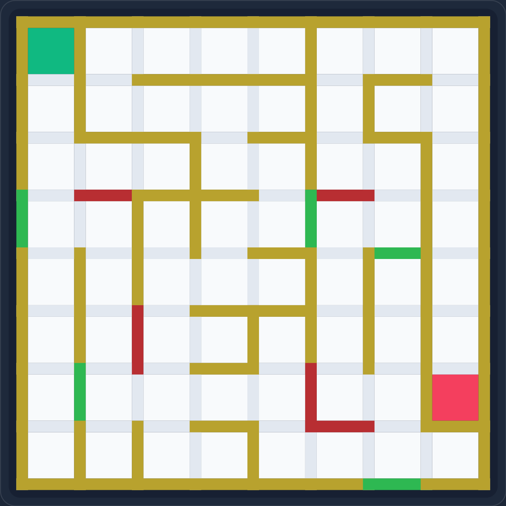 | 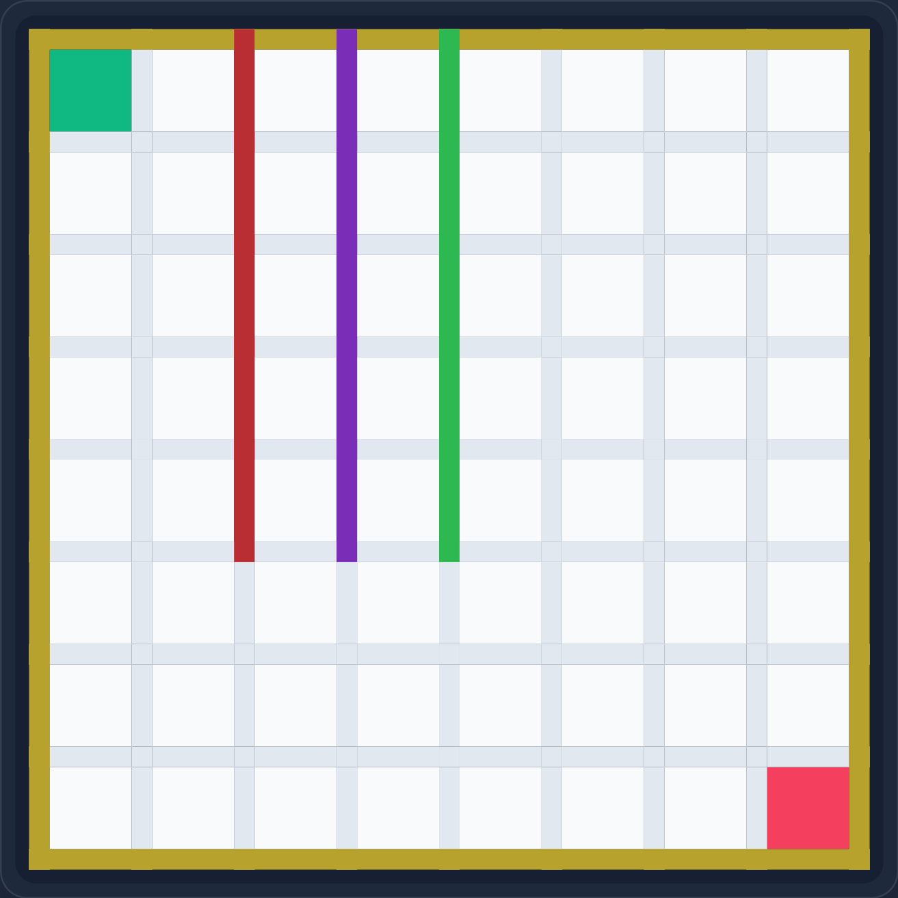 |

`maze_layout.png` is the layout reference for the full-maze Genesis and Isaac renders. `wall_layout.png` is the wall-face reference for the front and back wall renders.

| Genesis | Isaac |
| --- | --- |
| 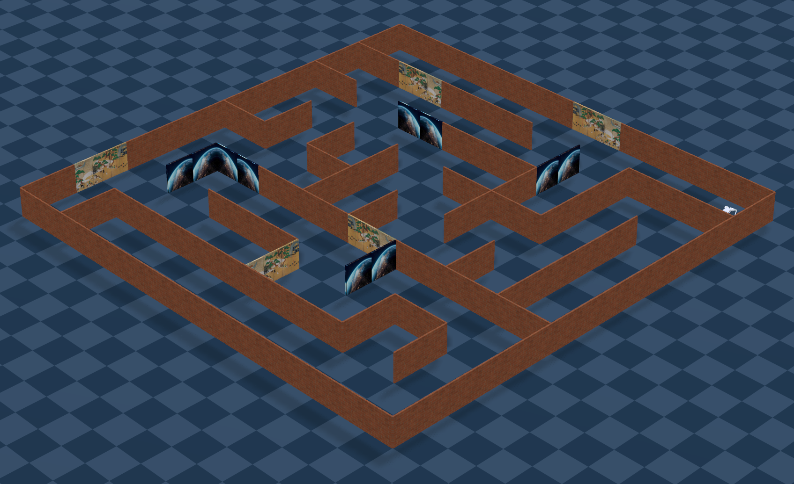 | 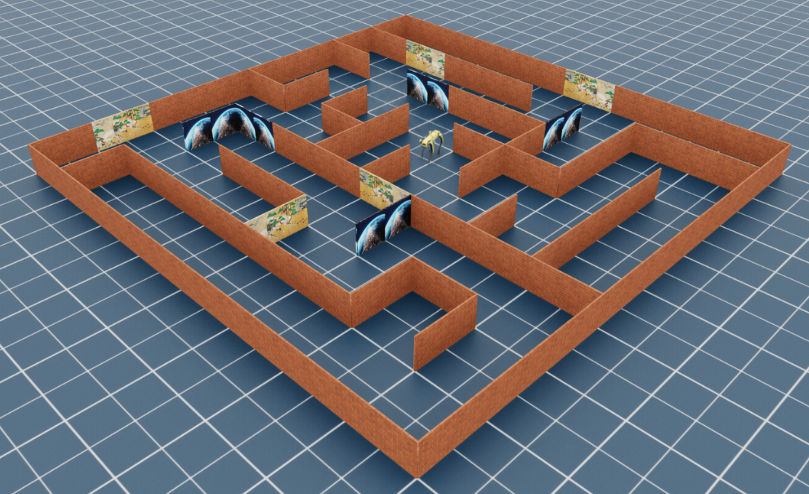 |

| Genesis Front View | Isaac Front View |
| --- | --- |
| 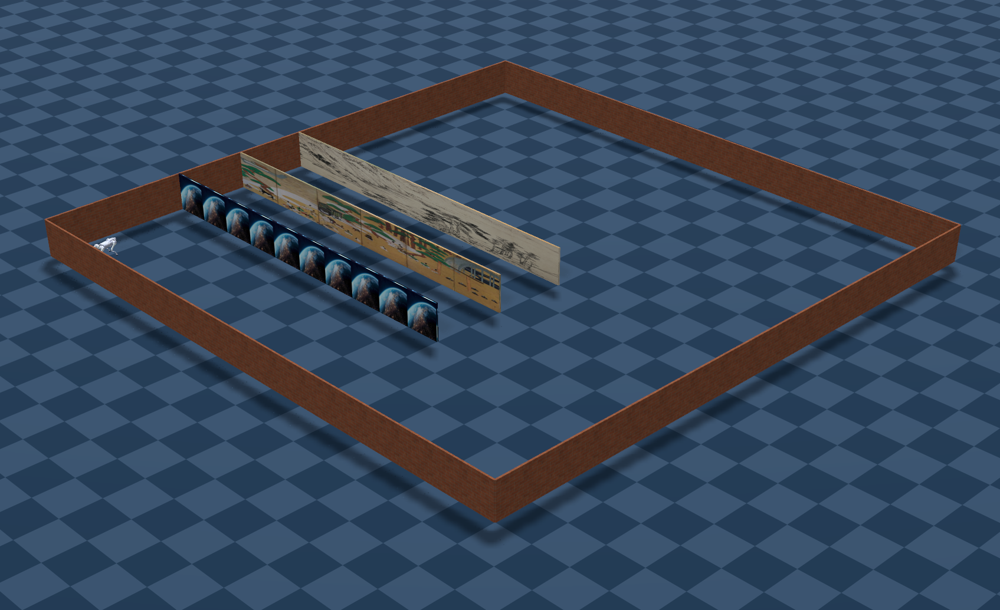 | 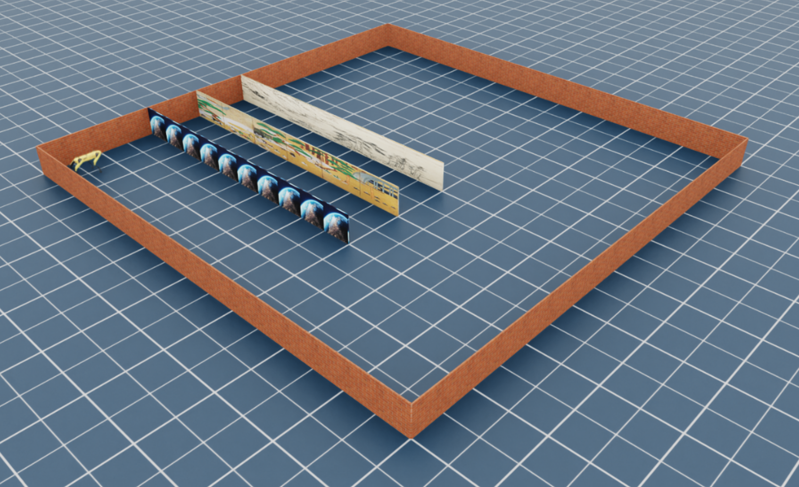 |

| Genesis Back View | Isaac Back View |
| --- | --- |
| 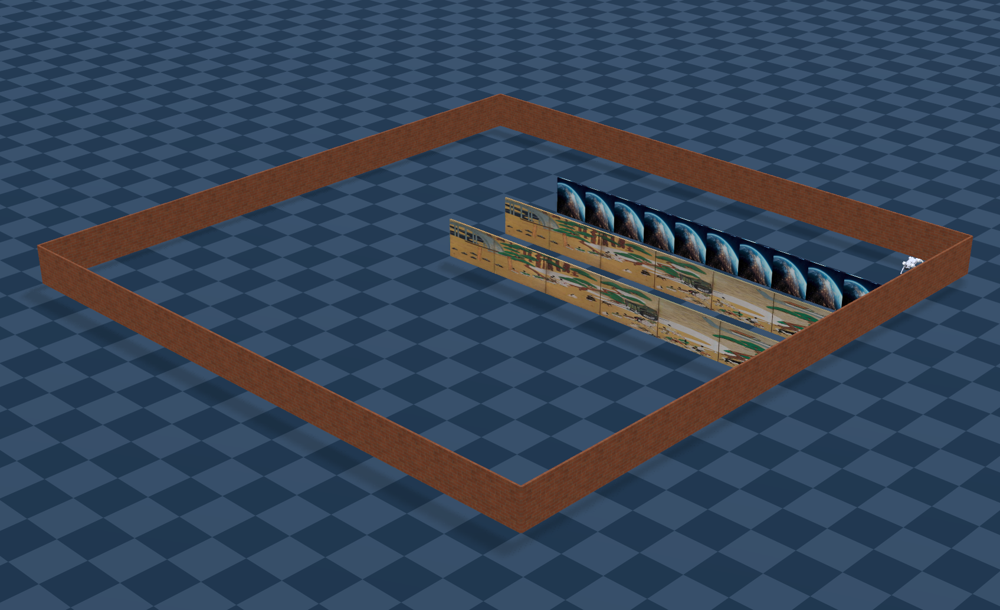 | 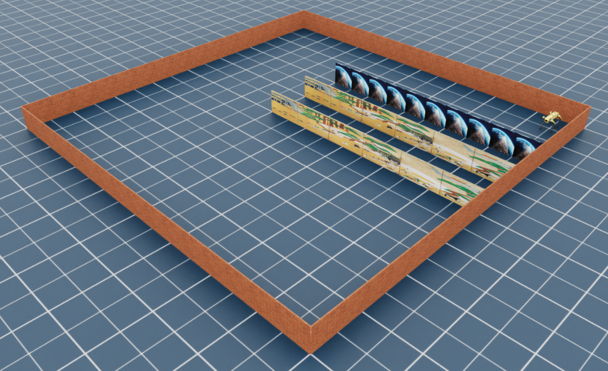 |

## Repository Structure

```text
py-ant-maze/
├── README.md
├── LICENSE
├── examples/                    # Sample YAML/PNG/USD/OBJ outputs
├── py_ant_maze/                 # Core Python package
│   ├── src/py_ant_maze/
│   └── examples/
├── maze_generator/              # USD/OBJ export package
│   └── src/maze_generator/
└── maze_editor/                 # React + Pyodide web editor
    ├── src/
    ├── public/
    └── media/                   # Demo GIFs
```

## Features

| Capability | `py_ant_maze` | `maze_generator` | `maze_editor` |
| --- | --- | --- | --- |
| Parse + validate maze YAML | Yes | Via `py_ant_maze` | Yes (via Pyodide) |
| Mutable editing API | Yes (`MazeDraft`) | No | Yes (visual + YAML) |
| 2D maze families (`occupancy_grid`, `edge_grid`, `radial_arm`) | Yes | `occupancy_grid`, `edge_grid` | Yes |
| 3D maze families (`*_3d`) | Yes | Not exported yet | Yes |
| YAML -> image | Yes (2D occupancy/edge) | No | Yes (PNG export) |
| USD/OBJ export | No | Yes | No |

## Typical Workflow

The three packages are meant to be used together:

1. Author or edit a maze in YAML.
2. Parse and validate it with `py_ant_maze`.
3. Iterate visually in `maze_editor` if needed.
4. Export simulator assets with `maze_generator`.
5. Load the same maze YAML and exported geometry in downstream projects such as Genesis or Isaac.

For simulator pipelines, keep the maze frame consistent across export and runtime:

- `config`: authored indexing
- `simulation_genesis`: Y-flipped simulation frame
- `simulation_isaac`: X-flipped simulation frame

## Quick Start

### 1) Install Python packages

```bash
pip install -e py_ant_maze
pip install -e maze_generator
```

### 2) Work with mazes in Python

```python
from py_ant_maze import Maze

maze = Maze.from_file("path/to/maze.yaml")
print(maze.to_text(with_grid_numbers=True))
```

### 3) Convert between YAML and images (2D occupancy/edge only)

```python
from py_ant_maze import image_to_yaml_file, config_file_to_image
config_file_to_image("maze.yaml", "maze-layout.png")
```

### 4) Export geometry

```bash
# USD
maze-generator path/to/maze.yaml -o path/to/output.usda

# OBJ bundle (visual.obj, collider.obj, textures/)
maze-generator path/to/maze.yaml --format obj -o path/to/output_obj_bundle
```

### 5) Use the editor

- Deployed app: https://maze.yihao.one
- Local dev:

```bash
cd py_ant_maze
python -m build

cd ../maze_editor
npm install
npm run dev
```

The deployed editor is also available at `https://maze.yihao.one`.

## Additional Package Notes

`py_ant_maze` provides the core model and runtime layer:

- `Maze`: immutable validated maze object
- `MazeDraft`: mutable editing surface
- `MazeRuntime`: semantic indexing and rectangular cell access
- `MazeSpatialRuntime`: wall-distance and other spatial queries for supported 2D maze types

`maze_generator` currently exports:

- `occupancy_grid`
- `edge_grid`

Export outputs:

- USD: merged wall mesh at `/Maze/Walls/merged_walls`, materials under `/Maze/Materials`, colliders under `/Maze/Colliders`
- OBJ: `visual.obj`, `collider.obj`, material files, and copied textures in `textures/`

`maze_editor` runs `py_ant_maze` inside Pyodide so browser-side parsing and mutation behavior stays aligned with the Python package.

## Maze Families

| Family | 2D | 3D |
| --- | --- | --- |
| Occupancy Grid | `occupancy_grid` | `occupancy_grid_3d` |
| Edge Grid | `edge_grid` | `edge_grid_3d` |
| Radial Arm | `radial_arm` | `radial_arm_3d` |

## Maze Editor Demos

| Demo | Preview |
| --- | --- |
| Maze families and templates |  |
| 2D and 3D editing |  |
| Add start/end points | 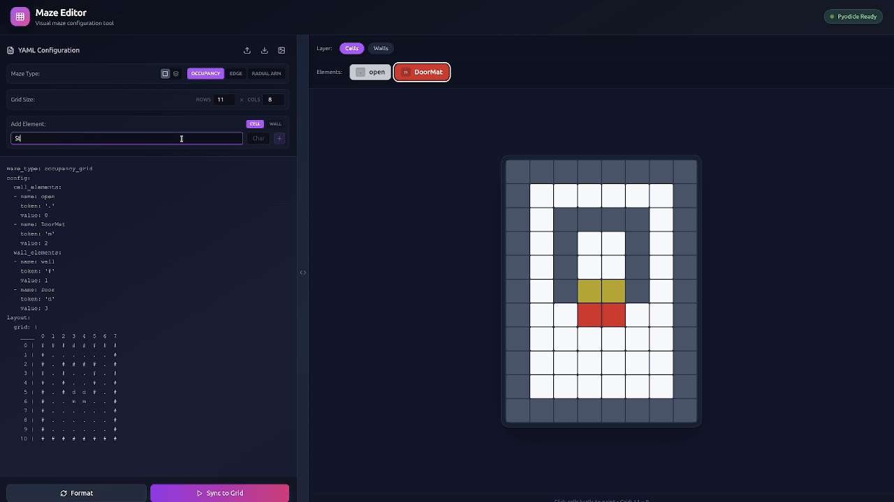 |
| Occupancy cell size controls | 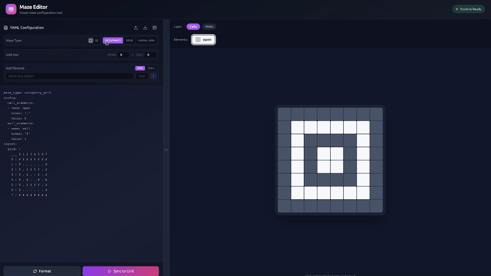 |
| Paint occupancy cells | 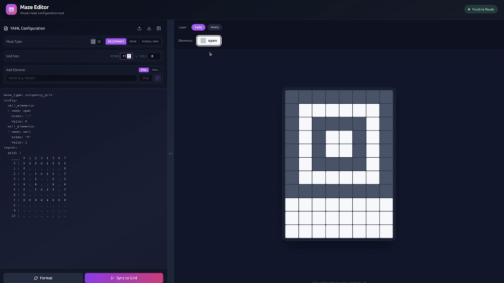 |
| Edge-grid editing |  |
| Add elements and connectors | 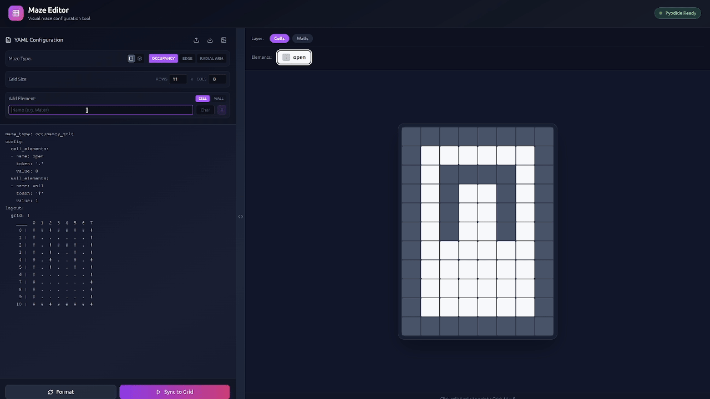 |
| Radial-arm editing | 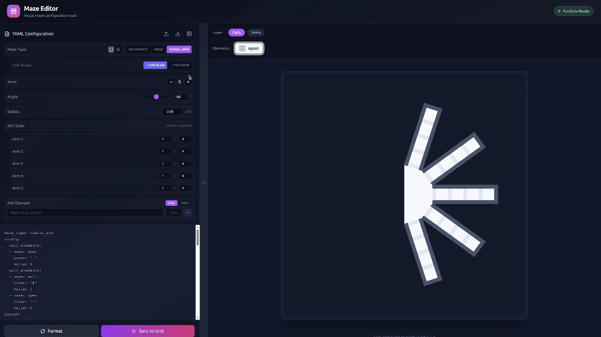 |
| Radial-arm polygon editing | 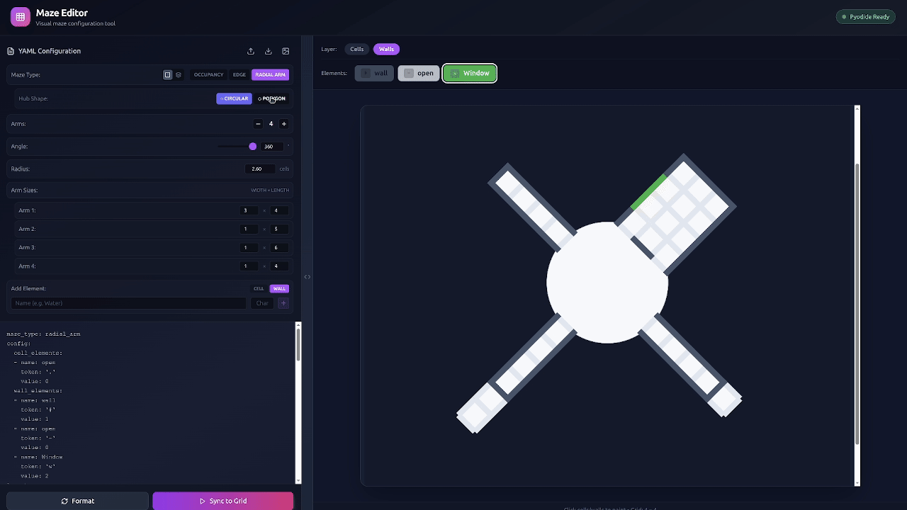 |
| Save YAML config | 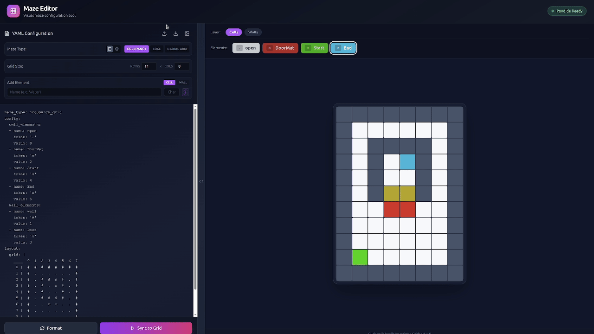 |
| Save PNG image |  |


## Notes

- USD export writes merged visual walls at `/Maze/Walls/merged_walls` plus separate compound box colliders at `/Maze/Colliders/*`.
- OBJ export writes `visual.obj`, `collider.obj`, and copied textures into a bundle directory.

## Package READMEs

- Core API details: [`py_ant_maze/README.md`](py_ant_maze/README.md)
- Geometry export details: [`maze_generator/README.md`](maze_generator/README.md)
- Browser editor details: [`maze_editor/README.md`](maze_editor/README.md)

## License

MIT
